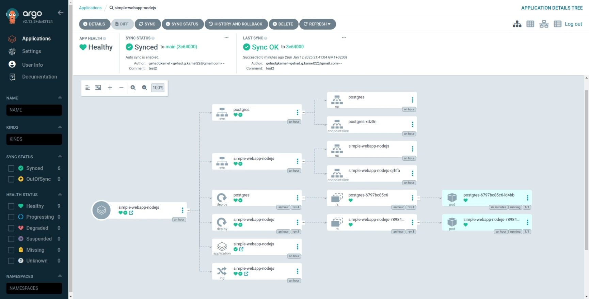

# Node.js Application Containerized with Docker and Hosted on Amazon EKS.

This is a simple web application built with Node.js, Express, and PostgreSQL. It allows users to view, create, and manage posts stored in a PostgreSQL database. The project is containerized using Docker, orchestrated with Kubernetes, and managed using Argo CD. Infrastructure is provisioned using Terraform.


## Features
- **_View Posts_**: Display a list of posts from the PostgreSQL database.
- **_Dockerized_**: The application and database can be run in Docker containers.

- **Kubernetes Deployment**: The application can be deployed to a Kubernetes cluster.

- **GitOps with Argo CD**: Kubernetes manifests are managed using Argo CD.

- **Infrastructure as Code**: Terraform is used to provision cloud resources.

- **CI Pipeline**: GitHub Actions automates image build and push process.


## Prerequisites
Node.js 

npm (Node Package Manager)

Docker (for containerization)

Amazon Elastic Kubernetes Service (EKS) (for container orchestration)

Argo CD (for GitOps)

Terraform (for infrastructure provisioning)

PostgreSQL (or use the provided Docker setup)


## Getting Started
1. Clone the Repository 

```bash
git clone https://github.com/your-username/simple-webapp-nodejs.git
cd simple-webapp-nodejs
```

2. Install Dependencies
Install the required Node.js dependencies:

```bash
npm install
```

3. Run the Application locally

```bash
npm start
```

4. Run the Application in Docker

```bash
docker build -t simple-webapp-nodejs:latest .
docker run --name simple-webapp-nodejs --rm -p 8000:8000 -e DB_HOST=172.17.0.2 simple-webapp-nodejs
```

5. Run docker compose

```bash
docker compose up -d 
```

6. Build infrastructure with Terraform

```bash
terraform init
terraform plan
terraform apply
```

7. Run EKS Cluster

```bash 
aws eks update-kubeconfig --name ex-terraform --region us-east-1
```

8. Run Kubectl

```bash 
kubectl get all
```
9. Install Argo CD

```bash
kubectl create namespace argocd
kubectl apply -n argocd -f https://raw.githubusercontent.com/argoproj/argo-cd/stable/manifests/install.yaml
```

10. Run Argo CD Dashboard

```bash              
kubectl port-forward svc/argocd-server -n argocd 8080:443
```                             

11. destroy infrastructure with Terraform

```bash
terraform destroy
```


### CI/CD Pipeline
The project includes a GitHub Actions workflow `(docker-image.yml)` to automate the build and push of Docker images.

#### Workflow Steps:
1. Build Docker Image: Builds the Docker image for the application.

2. Push to Docker Hub: Pushes the Docker image to Docker Hub.

3. Trigger Argo CD Sync: Triggers Argo CD to sync the application (provisioning).


To use the workflow:

1. Set up the following secrets in your GitHub repository:

- `DOCKER_USERNAME`: Your Docker Hub username.

- `DOCKER_PASSWORD`: Your Docker Hub password.

- `ARGOCD_API_KEY`: Your Argo CD API key (provisioning).

2. Push changes to the `main` branch to trigger the workflow.

### Argo CD Configuration

The `application.yaml` file defines the Argo CD Application resource, which manages the deployment of the PostgreSQL database and the Node.js app.




### Conclusion
This project demonstrates the deployment of a Node.js application using EKS cluster on AWS, including automated provisioning of infrastructure, Kubernetes management, and CI/CD for a Dockerized application. 
